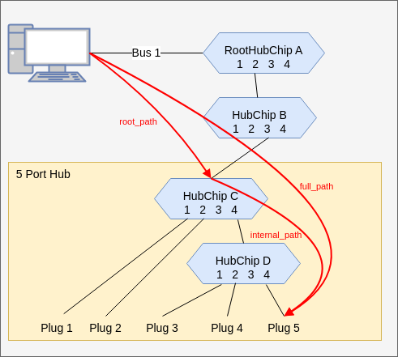

# Design

## Datastructures

Note: `Hub` is a assembled hub you buy in a store.

* A `HubChip` has `ports`.

* However a `Hub` is sold in a shop and has `plugs` where you connect the USB cables.

Such a `Hub` will contain one or more `HubChips`, which are chips with `ports` numbered from 1 to x.

### Path

The syntax of a path is taken from `ls /sys/bus/usb/devices`:

 `<bus#>-<port#>.<port#>.<port#>`

Here are some path for above example:

* `full_path` to `Plug 5`: `1-2.3.4.4`
* `internal_path` to `Plug 5`: `4.4`
* `root_path` to the `5 Port Hub`: `1-2.3`

## Packages

### Topology

Datastructure to store `path`.

Datastructure to store the `internal` `topology` of a `hub`.

Methods to compare if a `path` is a subpath of another `path`.

Method to find a `Hub` (specified by the `internal topology`) within a topology found by `lsusb -t`.

### Hub specifications for know hubs

A `hub` is specified by listing all `relative_path` to the `plugs`. 

### USB controller

Given is

* A list of expected `hubs`.

Reads the topology using `lsusb -t`, find the exepected `hubs`.

Now all plugs are know an may be powered on/off.