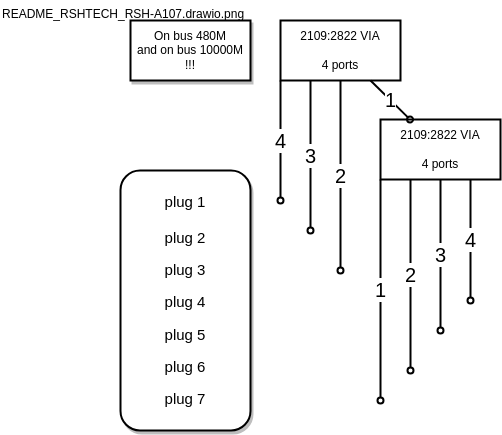

# RSHTECH_RSH-A107.md

https://www.rshtech.com/products/powered-usb-hub-rosonway-7-ports-usb-32-gen-2-usb-c-hub-10gbps-with-33ft-usb-a-usb-c-data-cable-and-24w-power-adapter-rsh-a107

https://www.aliexpress.com/item/1005006130981731.html


## Assessment

* **Overall: Powerswitching using `uhubctl` does NOT work! See also: https://github.com/mvp/uhubctl/issues/434**

* Positive: Power switching works fine on every port
* Positive: Port switching may be done on Hub and remotely
* Negative: LEDs hardly visible
* Negative: Ports are not numbered
* Negative: Switching is very slow: 4s

## Links where this HUB is mentioned

* None

## Hub Topology

See [rsh_a07.py](../usbhubctl/known_hubs/rsh_a107.py)


## Internals



```
sudo uhubctl 
Current status for hub 4-1.1 [2109:0822 VIA Labs, Inc. USB3.1 Hub, USB 3.20, 4 ports, ppps]
  Port 1: 02a0 power 5gbps Rx.Detect
  Port 2: 02a0 power 5gbps Rx.Detect
  Port 3: 02a0 power 5gbps Rx.Detect
  Port 4: 02a0 power 5gbps Rx.Detect
Current status for hub 4-1 [2109:0822 VIA Labs, Inc. USB3.1 Hub, USB 3.20, 4 ports, ppps]
  Port 1: 0263 power 5gbps U3 enable connect [2109:0822 VIA Labs, Inc. USB3.1 Hub, USB 3.20, 4 ports, ppps]
  Port 2: 02a0 power 5gbps Rx.Detect
  Port 3: 02a0 power 5gbps Rx.Detect
  Port 4: 02a0 power 5gbps Rx.Detect
Current status for hub 3-1.1 [2109:2822 VIA Labs, Inc. USB2.0 Hub, USB 2.10, 4 ports, ppps]
  Port 1: 0100 power
  Port 2: 0100 power
  Port 3: 0100 power
  Port 4: 0100 power
Current status for hub 3-1 [2109:2822 VIA Labs, Inc. USB2.0 Hub, USB 2.10, 4 ports, ppps]
  Port 1: 0507 power highspeed suspend enable connect [2109:2822 VIA Labs, Inc. USB2.0 Hub, USB 2.10, 4 ports, ppps]
  Port 2: 0100 power
  Port 3: 0100 power
  Port 4: 0100 power
```

```
# sudo dmesg --follow
[  448.004439] usb 4-1: new SuperSpeed USB device number 2 using xhci_hcd
[  448.057957] usb 4-1: New USB device found, idVendor=2109, idProduct=0822, bcdDevice= 8.b4
[  448.057967] usb 4-1: New USB device strings: Mfr=1, Product=2, SerialNumber=0
[  448.057971] usb 4-1: Product: USB3.1 Hub             
[  448.057974] usb 4-1: Manufacturer: VIA Labs, Inc.         
[  448.060980] hub 4-1:1.0: USB hub found
[  448.061363] hub 4-1:1.0: 4 ports detected
[  448.183747] usb 3-1: new high-speed USB device number 21 using xhci_hcd
[  448.335024] usb 3-1: New USB device found, idVendor=2109, idProduct=2822, bcdDevice= 8.b4
[  448.335029] usb 3-1: New USB device strings: Mfr=1, Product=2, SerialNumber=0
[  448.335030] usb 3-1: Product: USB2.0 Hub             
[  448.335031] usb 3-1: Manufacturer: VIA Labs, Inc.         
[  448.337009] hub 3-1:1.0: USB hub found
[  448.337225] hub 3-1:1.0: 4 ports detected
[  448.960399] usb 4-1.1: new SuperSpeed USB device number 3 using xhci_hcd
[  449.010321] usb 4-1.1: New USB device found, idVendor=2109, idProduct=0822, bcdDevice= 8.b4
[  449.010326] usb 4-1.1: New USB device strings: Mfr=1, Product=2, SerialNumber=0
[  449.010327] usb 4-1.1: Product: USB3.1 Hub             
[  449.010328] usb 4-1.1: Manufacturer: VIA Labs, Inc.         
[  449.023361] hub 4-1.1:1.0: USB hub found
[  449.023655] hub 4-1.1:1.0: 4 ports detected
[  449.319720] usb 3-1.1: new high-speed USB device number 22 using xhci_hcd
[  449.423321] usb 3-1.1: New USB device found, idVendor=2109, idProduct=2822, bcdDevice= 8.b4
[  449.423333] usb 3-1.1: New USB device strings: Mfr=1, Product=2, SerialNumber=0
[  449.423336] usb 3-1.1: Product: USB2.0 Hub             
[  449.423339] usb 3-1.1: Manufacturer: VIA Labs, Inc.         
[  449.425516] hub 3-1.1:1.0: USB hub found
[  449.425769] hub 3-1.1:1.0: 4 ports detected
```

```
sudo lsusb -d 2109: -v

Bus 004 Device 003: ID 2109:0822 VIA Labs, Inc. USB3.1 Hub             
Device Descriptor:
  bLength                18
  bDescriptorType         1
  bcdUSB               3.20
  bDeviceClass            9 Hub
  bDeviceSubClass         0 
  bDeviceProtocol         3 
  bMaxPacketSize0         9
  idVendor           0x2109 VIA Labs, Inc.
  idProduct          0x0822 
  bcdDevice            8.b4
  iManufacturer           1 VIA Labs, Inc.         
  iProduct                2 USB3.1 Hub             
  iSerial                 0 
  bNumConfigurations      1
  Configuration Descriptor:
    bLength                 9
    bDescriptorType         2
    wTotalLength       0x001f
    bNumInterfaces          1
    bConfigurationValue     1
    iConfiguration          0 
    bmAttributes         0xe0
      Self Powered
      Remote Wakeup
    MaxPower                0mA
    Interface Descriptor:
      bLength                 9
      bDescriptorType         4
      bInterfaceNumber        0
      bAlternateSetting       0
      bNumEndpoints           1
      bInterfaceClass         9 Hub
      bInterfaceSubClass      0 
      bInterfaceProtocol      0 Full speed (or root) hub
      iInterface              0 
      Endpoint Descriptor:
        bLength                 7
        bDescriptorType         5
        bEndpointAddress     0x81  EP 1 IN
        bmAttributes           19
          Transfer Type            Interrupt
          Synch Type               None
          Usage Type               Feedback
        wMaxPacketSize     0x0002  1x 2 bytes
        bInterval               8
        bMaxBurst               0
Binary Object Store Descriptor:
  bLength                 5
  bDescriptorType        15
  wTotalLength       0x002a
  bNumDeviceCaps          3
  USB 2.0 Extension Device Capability:
    bLength                 7
    bDescriptorType        16
    bDevCapabilityType      2
    bmAttributes   0x00000002
      HIRD Link Power Management (LPM) Supported
  SuperSpeed USB Device Capability:
    bLength                10
    bDescriptorType        16
    bDevCapabilityType      3
    bmAttributes         0x00
    wSpeedsSupported   0x000e
      Device can operate at Full Speed (12Mbps)
      Device can operate at High Speed (480Mbps)
      Device can operate at SuperSpeed (5Gbps)
    bFunctionalitySupport   1
      Lowest fully-functional device speed is Full Speed (12Mbps)
    bU1DevExitLat           4 micro seconds
    bU2DevExitLat         231 micro seconds
  Container ID Device Capability:
    bLength                20
    bDescriptorType        16
    bDevCapabilityType      4
    bReserved               0
    ContainerID             {30eef35c-07d5-2549-b001-802d79434c30}
Hub Descriptor:
  bLength              12
  bDescriptorType      42
  nNbrPorts             4
  wHubCharacteristic 0x0009
    Per-port power switching
    Per-port overcurrent protection
  bPwrOn2PwrGood      175 * 2 milli seconds
  bHubContrCurrent      0 milli Ampere
  bHubDecLat          0.4 micro seconds
  wHubDelay          2292 nano seconds
  DeviceRemovable    0x00
 Hub Port Status:
   Port 1: 0000.02a0 5Gbps power Rx.Detect
   Port 2: 0000.02a0 5Gbps power Rx.Detect
   Port 3: 0000.02a0 5Gbps power Rx.Detect
   Port 4: 0000.02a0 5Gbps power Rx.Detect
Device Status:     0x000d
  Self Powered
  U1 Enabled
  U2 Enabled

Bus 004 Device 002: ID 2109:0822 VIA Labs, Inc. USB3.1 Hub             
Device Descriptor:
  bLength                18
  bDescriptorType         1
  bcdUSB               3.20
  bDeviceClass            9 Hub
  bDeviceSubClass         0 
  bDeviceProtocol         3 
  bMaxPacketSize0         9
  idVendor           0x2109 VIA Labs, Inc.
  idProduct          0x0822 
  bcdDevice            8.b4
  iManufacturer           1 VIA Labs, Inc.         
  iProduct                2 USB3.1 Hub             
  iSerial                 0 
  bNumConfigurations      1
  Configuration Descriptor:
    bLength                 9
    bDescriptorType         2
    wTotalLength       0x001f
    bNumInterfaces          1
    bConfigurationValue     1
    iConfiguration          0 
    bmAttributes         0xe0
      Self Powered
      Remote Wakeup
    MaxPower                0mA
    Interface Descriptor:
      bLength                 9
      bDescriptorType         4
      bInterfaceNumber        0
      bAlternateSetting       0
      bNumEndpoints           1
      bInterfaceClass         9 Hub
      bInterfaceSubClass      0 
      bInterfaceProtocol      0 Full speed (or root) hub
      iInterface              0 
      Endpoint Descriptor:
        bLength                 7
        bDescriptorType         5
        bEndpointAddress     0x81  EP 1 IN
        bmAttributes           19
          Transfer Type            Interrupt
          Synch Type               None
          Usage Type               Feedback
        wMaxPacketSize     0x0002  1x 2 bytes
        bInterval               8
        bMaxBurst               0
Binary Object Store Descriptor:
  bLength                 5
  bDescriptorType        15
  wTotalLength       0x002a
  bNumDeviceCaps          3
  USB 2.0 Extension Device Capability:
    bLength                 7
    bDescriptorType        16
    bDevCapabilityType      2
    bmAttributes   0x00000002
      HIRD Link Power Management (LPM) Supported
  SuperSpeed USB Device Capability:
    bLength                10
    bDescriptorType        16
    bDevCapabilityType      3
    bmAttributes         0x00
    wSpeedsSupported   0x000e
      Device can operate at Full Speed (12Mbps)
      Device can operate at High Speed (480Mbps)
      Device can operate at SuperSpeed (5Gbps)
    bFunctionalitySupport   1
      Lowest fully-functional device speed is Full Speed (12Mbps)
    bU1DevExitLat           4 micro seconds
    bU2DevExitLat         231 micro seconds
  Container ID Device Capability:
    bLength                20
    bDescriptorType        16
    bDevCapabilityType      4
    bReserved               0
    ContainerID             {30eef35c-07d5-2549-b001-802d79434c30}
Hub Descriptor:
  bLength              12
  bDescriptorType      42
  nNbrPorts             4
  wHubCharacteristic 0x0009
    Per-port power switching
    Per-port overcurrent protection
  bPwrOn2PwrGood      175 * 2 milli seconds
  bHubContrCurrent      0 milli Ampere
  bHubDecLat          0.4 micro seconds
  wHubDelay          2292 nano seconds
  DeviceRemovable    0x00
 Hub Port Status:
   Port 1: 0000.0263 5Gbps power suspend enable connect
   Port 2: 0000.02a0 5Gbps power Rx.Detect
   Port 3: 0000.02a0 5Gbps power Rx.Detect
   Port 4: 0000.02a0 5Gbps power Rx.Detect
Device Status:     0x000d
  Self Powered
  U1 Enabled
  U2 Enabled

Bus 003 Device 013: ID 2109:0812 VIA Labs, Inc. VL812 Hub
Device Descriptor:
  bLength                18
  bDescriptorType         1
  bcdUSB               2.00
  bDeviceClass            9 Hub
  bDeviceSubClass         0 
  bDeviceProtocol         1 Single TT
  bMaxPacketSize0        64
  idVendor           0x2109 VIA Labs, Inc.
  idProduct          0x0812 VL812 Hub
  bcdDevice            1.90
  iManufacturer           0 
  iProduct                1 USB2.0 Hub
  iSerial                 0 
  bNumConfigurations      1
  Configuration Descriptor:
    bLength                 9
    bDescriptorType         2
    wTotalLength       0x0019
    bNumInterfaces          1
    bConfigurationValue     1
    iConfiguration          0 
    bmAttributes         0xe0
      Self Powered
      Remote Wakeup
    MaxPower              100mA
    Interface Descriptor:
      bLength                 9
      bDescriptorType         4
      bInterfaceNumber        0
      bAlternateSetting       0
      bNumEndpoints           1
      bInterfaceClass         9 Hub
      bInterfaceSubClass      0 
      bInterfaceProtocol      0 Full speed (or root) hub
      iInterface              0 
      Endpoint Descriptor:
        bLength                 7
        bDescriptorType         5
        bEndpointAddress     0x81  EP 1 IN
        bmAttributes            3
          Transfer Type            Interrupt
          Synch Type               None
          Usage Type               Data
        wMaxPacketSize     0x0001  1x 1 bytes
        bInterval              12
Hub Descriptor:
  bLength               9
  bDescriptorType      41
  nNbrPorts             4
  wHubCharacteristic 0x00e9
    Per-port power switching
    Per-port overcurrent protection
    TT think time 32 FS bits
    Port indicators
  bPwrOn2PwrGood       50 * 2 milli seconds
  bHubContrCurrent    100 milli Ampere
  DeviceRemovable    0x00
  PortPwrCtrlMask    0xff
 Hub Port Status:
   Port 1: 0000.0503 highspeed power enable connect
   Port 2: 0000.0100 power
   Port 3: 0000.0100 power
   Port 4: 0000.0100 power
Device Qualifier (for other device speed):
  bLength                10
  bDescriptorType         6
  bcdUSB               2.00
  bDeviceClass            9 Hub
  bDeviceSubClass         0 
  bDeviceProtocol         0 Full speed (or root) hub
  bMaxPacketSize0        64
  bNumConfigurations      1
Device Status:     0x0001
  Self Powered

Bus 003 Device 022: ID 2109:2822 VIA Labs, Inc. USB2.0 Hub             
Device Descriptor:
  bLength                18
  bDescriptorType         1
  bcdUSB               2.10
  bDeviceClass            9 Hub
  bDeviceSubClass         0 
  bDeviceProtocol         2 TT per port
  bMaxPacketSize0        64
  idVendor           0x2109 VIA Labs, Inc.
  idProduct          0x2822 
  bcdDevice            8.b4
  iManufacturer           1 VIA Labs, Inc.         
  iProduct                2 USB2.0 Hub             
  iSerial                 0 
  bNumConfigurations      1
  Configuration Descriptor:
    bLength                 9
    bDescriptorType         2
    wTotalLength       0x0029
    bNumInterfaces          1
    bConfigurationValue     1
    iConfiguration          0 
    bmAttributes         0xe0
      Self Powered
      Remote Wakeup
    MaxPower                0mA
    Interface Descriptor:
      bLength                 9
      bDescriptorType         4
      bInterfaceNumber        0
      bAlternateSetting       0
      bNumEndpoints           1
      bInterfaceClass         9 Hub
      bInterfaceSubClass      0 
      bInterfaceProtocol      1 Single TT
      iInterface              0 
      Endpoint Descriptor:
        bLength                 7
        bDescriptorType         5
        bEndpointAddress     0x81  EP 1 IN
        bmAttributes            3
          Transfer Type            Interrupt
          Synch Type               None
          Usage Type               Data
        wMaxPacketSize     0x0001  1x 1 bytes
        bInterval              12
    Interface Descriptor:
      bLength                 9
      bDescriptorType         4
      bInterfaceNumber        0
      bAlternateSetting       1
      bNumEndpoints           1
      bInterfaceClass         9 Hub
      bInterfaceSubClass      0 
      bInterfaceProtocol      2 TT per port
      iInterface              0 
      Endpoint Descriptor:
        bLength                 7
        bDescriptorType         5
        bEndpointAddress     0x81  EP 1 IN
        bmAttributes            3
          Transfer Type            Interrupt
          Synch Type               None
          Usage Type               Data
        wMaxPacketSize     0x0001  1x 1 bytes
        bInterval              12
Binary Object Store Descriptor:
  bLength                 5
  bDescriptorType        15
  wTotalLength       0x0049
  bNumDeviceCaps          5
  USB 2.0 Extension Device Capability:
    bLength                 7
    bDescriptorType        16
    bDevCapabilityType      2
    bmAttributes   0x00000006
      BESL Link Power Management (LPM) Supported
  SuperSpeed USB Device Capability:
    bLength                10
    bDescriptorType        16
    bDevCapabilityType      3
    bmAttributes         0x00
    wSpeedsSupported   0x000e
      Device can operate at Full Speed (12Mbps)
      Device can operate at High Speed (480Mbps)
      Device can operate at SuperSpeed (5Gbps)
    bFunctionalitySupport   1
      Lowest fully-functional device speed is Full Speed (12Mbps)
    bU1DevExitLat           4 micro seconds
    bU2DevExitLat         231 micro seconds
  Container ID Device Capability:
    bLength                20
    bDescriptorType        16
    bDevCapabilityType      4
    bReserved               0
    ContainerID             {30eef35c-07d5-2549-b001-802d79434c30}
  SuperSpeedPlus USB Device Capability:
    bLength                28
    bDescriptorType        16
    bDevCapabilityType     10
    bmAttributes         0x00000023
      Sublink Speed Attribute count 4
      Sublink Speed ID count 2
    wFunctionalitySupport   0x1100
      Min functional Speed Attribute ID: 0
      Min functional RX lanes: 1
      Min functional TX lanes: 1
    bmSublinkSpeedAttr[0]   0x00050030
      Speed Attribute ID: 0 5Gb/s Symmetric RX SuperSpeed
    bmSublinkSpeedAttr[1]   0x000500b0
      Speed Attribute ID: 0 5Gb/s Symmetric TX SuperSpeed
    bmSublinkSpeedAttr[2]   0x000a4031
      Speed Attribute ID: 1 10Gb/s Symmetric RX SuperSpeedPlus
    bmSublinkSpeedAttr[3]   0x000a40b1
      Speed Attribute ID: 1 10Gb/s Symmetric TX SuperSpeedPlus
  ** UNRECOGNIZED:  03 10 0b
Hub Descriptor:
  bLength               9
  bDescriptorType      41
  nNbrPorts             4
  wHubCharacteristic 0x00e9
    Per-port power switching
    Per-port overcurrent protection
    TT think time 32 FS bits
    Port indicators
  bPwrOn2PwrGood      175 * 2 milli seconds
  bHubContrCurrent    100 milli Ampere
  DeviceRemovable    0x00
  PortPwrCtrlMask    0xff
 Hub Port Status:
   Port 1: 0000.0100 power
   Port 2: 0000.0100 power
   Port 3: 0000.0100 power
   Port 4: 0000.0100 power
Device Status:     0x0001
  Self Powered

Bus 003 Device 021: ID 2109:2822 VIA Labs, Inc. USB2.0 Hub             
Device Descriptor:
  bLength                18
  bDescriptorType         1
  bcdUSB               2.10
  bDeviceClass            9 Hub
  bDeviceSubClass         0 
  bDeviceProtocol         2 TT per port
  bMaxPacketSize0        64
  idVendor           0x2109 VIA Labs, Inc.
  idProduct          0x2822 
  bcdDevice            8.b4
  iManufacturer           1 VIA Labs, Inc.         
  iProduct                2 USB2.0 Hub             
  iSerial                 0 
  bNumConfigurations      1
  Configuration Descriptor:
    bLength                 9
    bDescriptorType         2
    wTotalLength       0x0029
    bNumInterfaces          1
    bConfigurationValue     1
    iConfiguration          0 
    bmAttributes         0xe0
      Self Powered
      Remote Wakeup
    MaxPower                0mA
    Interface Descriptor:
      bLength                 9
      bDescriptorType         4
      bInterfaceNumber        0
      bAlternateSetting       0
      bNumEndpoints           1
      bInterfaceClass         9 Hub
      bInterfaceSubClass      0 
      bInterfaceProtocol      1 Single TT
      iInterface              0 
      Endpoint Descriptor:
        bLength                 7
        bDescriptorType         5
        bEndpointAddress     0x81  EP 1 IN
        bmAttributes            3
          Transfer Type            Interrupt
          Synch Type               None
          Usage Type               Data
        wMaxPacketSize     0x0001  1x 1 bytes
        bInterval              12
    Interface Descriptor:
      bLength                 9
      bDescriptorType         4
      bInterfaceNumber        0
      bAlternateSetting       1
      bNumEndpoints           1
      bInterfaceClass         9 Hub
      bInterfaceSubClass      0 
      bInterfaceProtocol      2 TT per port
      iInterface              0 
      Endpoint Descriptor:
        bLength                 7
        bDescriptorType         5
        bEndpointAddress     0x81  EP 1 IN
        bmAttributes            3
          Transfer Type            Interrupt
          Synch Type               None
          Usage Type               Data
        wMaxPacketSize     0x0001  1x 1 bytes
        bInterval              12
Binary Object Store Descriptor:
  bLength                 5
  bDescriptorType        15
  wTotalLength       0x0049
  bNumDeviceCaps          5
  USB 2.0 Extension Device Capability:
    bLength                 7
    bDescriptorType        16
    bDevCapabilityType      2
    bmAttributes   0x00000006
      BESL Link Power Management (LPM) Supported
  SuperSpeed USB Device Capability:
    bLength                10
    bDescriptorType        16
    bDevCapabilityType      3
    bmAttributes         0x00
    wSpeedsSupported   0x000e
      Device can operate at Full Speed (12Mbps)
      Device can operate at High Speed (480Mbps)
      Device can operate at SuperSpeed (5Gbps)
    bFunctionalitySupport   1
      Lowest fully-functional device speed is Full Speed (12Mbps)
    bU1DevExitLat           4 micro seconds
    bU2DevExitLat         231 micro seconds
  Container ID Device Capability:
    bLength                20
    bDescriptorType        16
    bDevCapabilityType      4
    bReserved               0
    ContainerID             {30eef35c-07d5-2549-b001-802d79434c30}
  SuperSpeedPlus USB Device Capability:
    bLength                28
    bDescriptorType        16
    bDevCapabilityType     10
    bmAttributes         0x00000023
      Sublink Speed Attribute count 4
      Sublink Speed ID count 2
    wFunctionalitySupport   0x1100
      Min functional Speed Attribute ID: 0
      Min functional RX lanes: 1
      Min functional TX lanes: 1
    bmSublinkSpeedAttr[0]   0x00050030
      Speed Attribute ID: 0 5Gb/s Symmetric RX SuperSpeed
    bmSublinkSpeedAttr[1]   0x000500b0
      Speed Attribute ID: 0 5Gb/s Symmetric TX SuperSpeed
    bmSublinkSpeedAttr[2]   0x000a4031
      Speed Attribute ID: 1 10Gb/s Symmetric RX SuperSpeedPlus
    bmSublinkSpeedAttr[3]   0x000a40b1
      Speed Attribute ID: 1 10Gb/s Symmetric TX SuperSpeedPlus
  ** UNRECOGNIZED:  03 10 0b
Hub Descriptor:
  bLength               9
  bDescriptorType      41
  nNbrPorts             4
  wHubCharacteristic 0x00e9
    Per-port power switching
    Per-port overcurrent protection
    TT think time 32 FS bits
    Port indicators
  bPwrOn2PwrGood      175 * 2 milli seconds
  bHubContrCurrent    100 milli Ampere
  DeviceRemovable    0x00
  PortPwrCtrlMask    0xff
 Hub Port Status:
   Port 1: 0000.0507 highspeed power suspend enable connect
   Port 2: 0000.0100 power
   Port 3: 0000.0100 power
   Port 4: 0000.0100 power
Device Status:     0x0001
  Self Powered
```