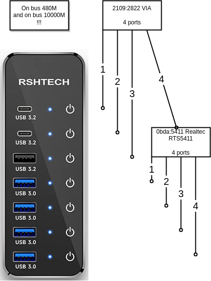

# RSHTECH_RSH-ST07C.md

https://www.rshtech.com/products/7-port-powered-usb-a-c-hub-with-10gbps-usb-a-2-usb-c-data-ports-4-usb-a-30-ports-5v-power-adapter-and-1m-33ft-usb-a-c-cable-rsh-st07c

https://www.aliexpress.com/item/1005006081837746.html
USD29


## Assessment

* **Overall: Powerswitching using `uhubctl` does NOT work on all plugs!**

* Positive: Power switching works fine on every port
* Positive: LEDs  visible
* Positive: Port switching may be done on Hub and remotely
* Negative: Ports are not numbered
* Negative: Switching is very slow: 4s
* Negative: Power switching does NOT work on Plug 1-3
* Negative: Uses Via Labs chip 2109:0822/2109:2822

## Links where this HUB is mentioned

* None

## Hub Topology

See [rsh_st07c.py](../pyhubctl/known_hubs/rsh_st07c.py)


## Internals



```
sudo uhubctl 
Current status for hub 3-5.2.1.1.4 [0bda:5411 Generic USB2.1 Hub, USB 2.10, 5 ports, ppps]
  Port 1: 0100 power
  Port 2: 0100 power
  Port 3: 0100 power
  Port 4: 0100 power
  Port 5: 0100 power
Current status for hub 3-5.2.1.1 [2109:2822 VIA Labs, Inc. USB2.0 Hub, USB 2.10, 4 ports, ppps]
  Port 1: 0100 power
  Port 2: 0100 power
  Port 3: 0100 power
  Port 4: 0507 power highspeed suspend enable connect [0bda:5411 Generic USB2.1 Hub, USB 2.10, 5 ports, ppps]
```

```
# sudo dmesg --follow
[ 1195.479498] usb 3-5.2: reset high-speed USB device number 32 using xhci_hcd
[ 1195.807119] usb 3-5.2: USB disconnect, device number 32
[ 1195.807131] usb 3-5.2.1: USB disconnect, device number 41
[ 1196.031059] usb 3-5.2: new high-speed USB device number 42 using xhci_hcd
[ 1196.132266] usb 3-5.2: New USB device found, idVendor=2109, idProduct=0812, bcdDevice= 1.90
[ 1196.132279] usb 3-5.2: New USB device strings: Mfr=0, Product=1, SerialNumber=0
[ 1196.132283] usb 3-5.2: Product: USB2.0 Hub
[ 1196.133861] hub 3-5.2:1.0: USB hub found
[ 1196.134008] hub 3-5.2:1.0: 4 ports detected
[ 1196.427011] usb 3-5.2.1: new high-speed USB device number 43 using xhci_hcd
[ 1196.527838] usb 3-5.2.1: New USB device found, idVendor=214b, idProduct=7250, bcdDevice= 1.00
[ 1196.527850] usb 3-5.2.1: New USB device strings: Mfr=0, Product=1, SerialNumber=0
[ 1196.527854] usb 3-5.2.1: Product: USB2.0 HUB
[ 1196.529404] hub 3-5.2.1:1.0: USB hub found
[ 1196.529455] hub 3-5.2.1:1.0: 4 ports detected
[ 1196.815062] usb 3-5.2.1.1: new high-speed USB device number 44 using xhci_hcd
[ 1196.918939] usb 3-5.2.1.1: New USB device found, idVendor=2109, idProduct=2822, bcdDevice= 8.b4
[ 1196.918951] usb 3-5.2.1.1: New USB device strings: Mfr=1, Product=2, SerialNumber=0
[ 1196.918955] usb 3-5.2.1.1: Product: USB2.0 Hub             
[ 1196.918958] usb 3-5.2.1.1: Manufacturer: VIA Labs, Inc.         
[ 1196.921050] hub 3-5.2.1.1:1.0: USB hub found
[ 1196.921501] hub 3-5.2.1.1:1.0: 4 ports detected
[ 1197.598931] usb 3-5.2.1.1.4: new high-speed USB device number 45 using xhci_hcd
[ 1197.710176] usb 3-5.2.1.1.4: New USB device found, idVendor=0bda, idProduct=5411, bcdDevice= 1.01
[ 1197.710189] usb 3-5.2.1.1.4: New USB device strings: Mfr=1, Product=2, SerialNumber=0
[ 1197.710193] usb 3-5.2.1.1.4: Product: USB2.1 Hub
[ 1197.710196] usb 3-5.2.1.1.4: Manufacturer: Generic
[ 1197.711972] hub 3-5.2.1.1.4:1.0: USB hub found
[ 1197.712715] hub 3-5.2.1.1.4:1.0: 5 ports detected
```

```
sudo lsusb -d 2109: -v

Bus 003 Device 044: ID 2109:2822 VIA Labs, Inc. USB2.0 Hub             
Device Descriptor:
  bLength                18
  bDescriptorType         1
  bcdUSB               2.10
  bDeviceClass            9 Hub
  bDeviceSubClass         0 
  bDeviceProtocol         2 TT per port
  bMaxPacketSize0        64
  idVendor           0x2109 VIA Labs, Inc.
  idProduct          0x2822 
  bcdDevice            8.b4
  iManufacturer           1 VIA Labs, Inc.         
  iProduct                2 USB2.0 Hub             
  iSerial                 0 
  bNumConfigurations      1
  Configuration Descriptor:
    bLength                 9
    bDescriptorType         2
    wTotalLength       0x0029
    bNumInterfaces          1
    bConfigurationValue     1
    iConfiguration          0 
    bmAttributes         0xe0
      Self Powered
      Remote Wakeup
    MaxPower                0mA
    Interface Descriptor:
      bLength                 9
      bDescriptorType         4
      bInterfaceNumber        0
      bAlternateSetting       0
      bNumEndpoints           1
      bInterfaceClass         9 Hub
      bInterfaceSubClass      0 
      bInterfaceProtocol      1 Single TT
      iInterface              0 
      Endpoint Descriptor:
        bLength                 7
        bDescriptorType         5
        bEndpointAddress     0x81  EP 1 IN
        bmAttributes            3
          Transfer Type            Interrupt
          Synch Type               None
          Usage Type               Data
        wMaxPacketSize     0x0001  1x 1 bytes
        bInterval              12
    Interface Descriptor:
      bLength                 9
      bDescriptorType         4
      bInterfaceNumber        0
      bAlternateSetting       1
      bNumEndpoints           1
      bInterfaceClass         9 Hub
      bInterfaceSubClass      0 
      bInterfaceProtocol      2 TT per port
      iInterface              0 
      Endpoint Descriptor:
        bLength                 7
        bDescriptorType         5
        bEndpointAddress     0x81  EP 1 IN
        bmAttributes            3
          Transfer Type            Interrupt
          Synch Type               None
          Usage Type               Data
        wMaxPacketSize     0x0001  1x 1 bytes
        bInterval              12
Binary Object Store Descriptor:
  bLength                 5
  bDescriptorType        15
  wTotalLength       0x0049
  bNumDeviceCaps          5
  USB 2.0 Extension Device Capability:
    bLength                 7
    bDescriptorType        16
    bDevCapabilityType      2
    bmAttributes   0x00000006
      BESL Link Power Management (LPM) Supported
  SuperSpeed USB Device Capability:
    bLength                10
    bDescriptorType        16
    bDevCapabilityType      3
    bmAttributes         0x00
    wSpeedsSupported   0x000e
      Device can operate at Full Speed (12Mbps)
      Device can operate at High Speed (480Mbps)
      Device can operate at SuperSpeed (5Gbps)
    bFunctionalitySupport   1
      Lowest fully-functional device speed is Full Speed (12Mbps)
    bU1DevExitLat           4 micro seconds
    bU2DevExitLat         231 micro seconds
  Container ID Device Capability:
    bLength                20
    bDescriptorType        16
    bDevCapabilityType      4
    bReserved               0
    ContainerID             {30eef35c-07d5-2549-b001-802d79434c30}
  SuperSpeedPlus USB Device Capability:
    bLength                28
    bDescriptorType        16
    bDevCapabilityType     10
    bmAttributes         0x00000023
      Sublink Speed Attribute count 4
      Sublink Speed ID count 2
    wFunctionalitySupport   0x1100
      Min functional Speed Attribute ID: 0
      Min functional RX lanes: 1
      Min functional TX lanes: 1
    bmSublinkSpeedAttr[0]   0x00050030
      Speed Attribute ID: 0 5Gb/s Symmetric RX SuperSpeed
    bmSublinkSpeedAttr[1]   0x000500b0
      Speed Attribute ID: 0 5Gb/s Symmetric TX SuperSpeed
    bmSublinkSpeedAttr[2]   0x000a4031
      Speed Attribute ID: 1 10Gb/s Symmetric RX SuperSpeedPlus
    bmSublinkSpeedAttr[3]   0x000a40b1
      Speed Attribute ID: 1 10Gb/s Symmetric TX SuperSpeedPlus
  ** UNRECOGNIZED:  03 10 0b
Hub Descriptor:
  bLength               9
  bDescriptorType      41
  nNbrPorts             4
  wHubCharacteristic 0x00e9
    Per-port power switching
    Per-port overcurrent protection
    TT think time 32 FS bits
    Port indicators
  bPwrOn2PwrGood      175 * 2 milli seconds
  bHubContrCurrent    100 milli Ampere
  DeviceRemovable    0x00
  PortPwrCtrlMask    0xff
 Hub Port Status:
   Port 1: 0000.0100 power
   Port 2: 0000.0100 power
   Port 3: 0000.0100 power
   Port 4: 0000.0507 highspeed power suspend enable connect
Device Status:     0x0001
  Self Powered

Bus 003 Device 042: ID 2109:0812 VIA Labs, Inc. VL812 Hub
Device Descriptor:
  bLength                18
  bDescriptorType         1
  bcdUSB               2.00
  bDeviceClass            9 Hub
  bDeviceSubClass         0 
  bDeviceProtocol         1 Single TT
  bMaxPacketSize0        64
  idVendor           0x2109 VIA Labs, Inc.
  idProduct          0x0812 VL812 Hub
  bcdDevice            1.90
  iManufacturer           0 
  iProduct                1 USB2.0 Hub
  iSerial                 0 
  bNumConfigurations      1
  Configuration Descriptor:
    bLength                 9
    bDescriptorType         2
    wTotalLength       0x0019
    bNumInterfaces          1
    bConfigurationValue     1
    iConfiguration          0 
    bmAttributes         0xe0
      Self Powered
      Remote Wakeup
    MaxPower              100mA
    Interface Descriptor:
      bLength                 9
      bDescriptorType         4
      bInterfaceNumber        0
      bAlternateSetting       0
      bNumEndpoints           1
      bInterfaceClass         9 Hub
      bInterfaceSubClass      0 
      bInterfaceProtocol      0 Full speed (or root) hub
      iInterface              0 
      Endpoint Descriptor:
        bLength                 7
        bDescriptorType         5
        bEndpointAddress     0x81  EP 1 IN
        bmAttributes            3
          Transfer Type            Interrupt
          Synch Type               None
          Usage Type               Data
        wMaxPacketSize     0x0001  1x 1 bytes
        bInterval              12
Hub Descriptor:
  bLength               9
  bDescriptorType      41
  nNbrPorts             4
  wHubCharacteristic 0x00e9
    Per-port power switching
    Per-port overcurrent protection
    TT think time 32 FS bits
    Port indicators
  bPwrOn2PwrGood       50 * 2 milli seconds
  bHubContrCurrent    100 milli Ampere
  DeviceRemovable    0x00
  PortPwrCtrlMask    0xff
 Hub Port Status:
   Port 1: 0000.0507 highspeed power suspend enable connect
   Port 2: 0000.0100 power
   Port 3: 0000.0303 lowspeed power enable connect
   Port 4: 0000.0303 lowspeed power enable connect
Device Qualifier (for other device speed):
  bLength                10
  bDescriptorType         6
  bcdUSB               2.00
  bDeviceClass            9 Hub
  bDeviceSubClass         0 
  bDeviceProtocol         0 Full speed (or root) hub
  bMaxPacketSize0        64
  bNumConfigurations      1
Device Status:     0x0001
  Self Powered
```